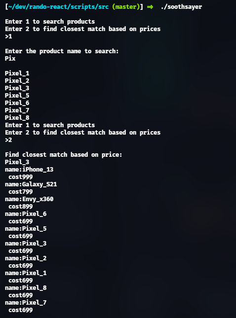

# DSA MiniProject Sem-3

### Simple E-Commerce product tracking and search.
#### Steps to run : 
    - git clone git@github.com:Noth2006/dsa.git 
    - cd dsa/src
    - make
    - ./soothsayer
> PPT included in this repo

- Tracking of packages ordered. ADT used : `Linked List(Create,Insert,Update,Delete)`.
- JSON Parsing : to feed data from database into the graph algorithm. ADT used : `Stack(push,pop)`.
- Closest Search Match. Finds the closest matches weighted by price. ADT used : `graphs`.

Done by : 
Nitheesh Pugazhanthi(PES2UG22CS371) 
Nikhil Srivatsa(PES2UG22CS357) 
Narayan S(PES2UG22CS339) 
Section F
